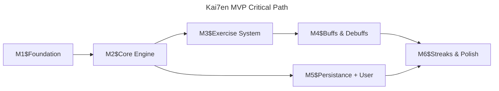

# Kai7en - V1 (MVP)

Application web gamifiée de fitness quotidien basée sur des mécaniques roguelike inspirées de Slay the Spire. L'utilisateur parcourt chaque jour une carte en arbre de 7 étapes composées d'exercices corporels sans équipement, d'événements aléatoires et de pauses. La philosophie centrale : la discipline l'emporte sur l'intensité.

## 1. Executive Summary

### Problem

Maintenir une routine sportive quotidienne est difficile. Les applications de fitness existantes misent sur l'intensité et la performance, ce qui décourage les utilisateurs qui décrochent rapidement. Il manque une approche ludique et accessible qui valorise la régularité plutôt que l'effort maximal.

### Solution

Kai7en est une application web qui gamifie l'exercice physique quotidien via un système de roguelike. Chaque jour, l'utilisateur lance un "run" de 7 étapes sur une carte en arbre générée aléatoirement. Les exercices sont courts (5 min max), sans équipement, et la progression repose sur la constance (streaks) plutôt que la performance.

### Success Criteria

- L'utilisateur peut compléter un run quotidien de 7 étapes sur une tree map
- Le système de streaks encourage le retour quotidien
- Les buffs/debuffs ajoutent de la variété et de la stratégie à chaque run

## 2. User Personas

### Primary Persona: Alex

| Attribute                 | Description                                                                |
| ------------------------- | -------------------------------------------------------------------------- |
| **Role**                  | Actif sédentaire (bureau, télétravail)                                     |
| **Goals**                 | Maintenir un minimum d'activité physique quotidienne                       |
| **Motivations**           | Santé long terme, pas la performance ; aime les jeux vidéo (gamification ) |
| **Frustrations**          | Apps fitness trop intenses, culpabilisantes, routines qui lassent vite     |
| **Technical Environment** | Navigateur web desktop/mobile, pas d'équipement sportif                    |

## 3. Goals & Objectives

### Business Goals

- BG1: Créer une habitude quotidienne chez l'utilisateur (rétention J7 > 40%)
- BG2: Construire une base d'utilisateurs engagés pour les features V2

### Technical Goals

- TG1: Architecture de difficulté dynamique avec multiplicateurs configurables
- TG2: Génération procédurale de maps fiable et équilibrée

### User Goals

- UG1: Pouvoir faire du sport en moins de 30 minutes sans préparation ni matériel
- UG2: Ressentir une progression et un plaisir ludique au quotidien

## 4. Core Features

- **F1: Tree Map & Run** : Carte en arbre de 7 étapes avec navigation et choix
- **F2: Système d'exercices** : Bibliothèque d'exercices avec validation sur l'honneur
- **F3: Buffs & Debuffs** : Modificateurs de run qui ajoutent stratégie et variété
- **F4: Streaks** : Système de suivi de la régularité quotidienne
- **F5: Authentification** : Inscription et connexion via Supabase

### F1: Tree Map & Run

- FR1.1: Générer une carte en arbre de 7 étapes avec un mix de chemins linéaires et d'embranchements (2-3 choix)
- FR1.2: La 7e étape est toujours un nœud Challenge (boss)
- FR1.3: Afficher les types de nœuds visibles sur la carte avant le choix
- FR1.4: L'utilisateur navigue de nœud en nœud séquentiellement
- FR1.5: Un run = 1 par jour, généré aléatoirement

#### User Stories

- As a user, I want to see a tree map of my daily run so that I can plan my path
- As a user, I want to choose between different paths when branches appear so that I have strategic agency

### F2: Système d'exercices

- FR2.1: Bibliothèque de ~10 exercices corporels sans équipement
- FR2.2: Chaque exercice a un nom, une description, des paramètres de difficulté dynamiques (reps ou durée)
- FR2.3: Pas de répétition du même exercice dans un run
- FR2.4: Validation sur l'honneur (bouton "Fait")
- FR2.5: Timer de 2 heures max par nœud ; au-delà, le nœud est considéré échoué

#### User Stories

- As a user, I want to see the exercise description and validate it when done so that I can progress through my run
- As a user, I want exercises to be different each run so that I don't get bored

### F3: Buffs & Debuffs

- FR3.1: ~10 buffs/debuffs au total
- FR3.2: Buffs : réduire la difficulté d'un exercice, sauter un exercice, changer de nœud
- FR3.3: Debuffs : exercice plus dur (plus de reps), durée allongée, repos retiré, plus d'events
- FR3.4: Les buffs/debuffs sont obtenus via les nœuds Event
- FR3.5: Après un échec de run, un buff est accordé au début du run suivant

#### User Stories

- As a user, I want buffs to help me when I'm struggling so that I stay motivated
- As a user, I want debuffs to add challenge and unpredictability so that each run feels unique

### F4: Streaks

- FR4.1: Compléter les 7 nœuds d'un run = streak maintenu
- FR4.2: Échec d'un nœud ou absence de run dans la journée = streak cassé
- FR4.3: Afficher le compteur de streak actuel
- FR4.4: Après un streak cassé, octroyer un buff de consolation au prochain run

#### User Stories

- As a user, I want to see my streak count so that I feel motivated to maintain it
- As a user, I want a consolation buff after losing my streak so that I'm encouraged to come back

### F5: Authentification

- FR5.1: Inscription par email + mot de passe via Supabase
- FR5.2: Connexion / déconnexion
- FR5.3: Persistance des données utilisateur (runs, streaks, progression)

#### User Stories

- As a user, I want to create an account so that my progress is saved

## 5. Acceptance Criteria

### Feature 1: Tree Map & Run

**Happy Path:**

```gherkin
Scenario: User starts a daily run
  Given the user is authenticated and has no active run today
  When the user starts a new run
  Then a tree map of 7 steps is generated with random node types
  And the 7th step is a Challenge (boss) node
  And the map displays a mix of linear paths and branching choices
```

```gherkin
Scenario: User navigates the tree map
  Given the user has an active run with a branching path at step 3
  When the user reaches step 3
  Then 2 or 3 node options are displayed
  And the user can select one to continue
```

**Error Scenarios:**

```gherkin
Scenario: User tries to start a second run in the same day
  Given the user already completed or failed a run today
  When the user attempts to start a new run
  Then the system prevents it and shows the next run availability
```

### Feature 2: Système d'exercices

**Happy Path:**

```gherkin
Scenario: User completes an exercise node
  Given the user is on a Challenge node with "Pompes - 15 répétitions"
  When the user clicks "Fait"
  Then the node is marked as completed
  And the user advances to the next step on the map
```

**Error Scenarios:**

```gherkin
Scenario: User exceeds the 2-hour time limit
  Given the user is on a Challenge node
  When 2 hours pass without validation
  Then the run is marked as failed
  And the streak is broken
  And a buff is granted for the next run
```

### Feature 3: Buffs & Debuffs

**Happy Path:**

```gherkin
Scenario: User receives a buff from an Event node
  Given the user lands on an Event node
  When the event resolves as a buff "Réduire difficulté"
  Then the next exercise node has reduced reps or duration
```

```gherkin
Scenario: User receives consolation buff after failure
  Given the user failed their previous run
  When the user starts a new run
  Then a buff is automatically applied at the start
```

### Feature 4: Streaks

**Happy Path:**

```gherkin
Scenario: User maintains streak
  Given the user has a 5-day streak
  When the user completes all 7 nodes today
  Then the streak counter increments to 6
```

**Error Scenarios:**

```gherkin
Scenario: User breaks streak by failing
  Given the user has a 5-day streak
  When the user fails a Challenge node
  Then the streak resets to 0
  And a consolation buff is stored for the next run
```

**Edge Cases:**

- [ ] User closes browser mid-run and returns within 2 hours
- [ ] User is in a different timezone — streak calculation based on UTC or local?

## 6. Non-Goals

| Non-Goal                              | Rationale                                         |
| ------------------------------------- | ------------------------------------------------- |
| Tracking automatique (caméra/sensors) | Philosophie "sur l'honneur", pas de vérification  |
| Social / leaderboard                  | Pas dans le MVP, focus sur l'expérience solo      |
| Application mobile native             | Web-first, PWA potentielle en V2                  |
| Méta-progression (tips, unlocks)      | Reporté en V2, le cœur est la tree map            |
| OAuth (Google, Apple)                 | Email + mot de passe suffisant pour le MVP        |
| Personnalisation des exercices        | Exercices prédéfinis, pas de création utilisateur |
| Mode multijoueur / coopératif         | Hors scope, expérience individuelle               |

## 7. Non-Functional Requirements

### Performance

- NFR1: Génération de la tree map < 500ms
- NFR2: Transition entre nœuds < 200ms
- NFR3: L'application doit fonctionner sur des connexions moyennes (3G+)

### Security

- NFR4: Authentification sécurisée via Supabase (bcrypt, JWT)
- NFR5: Les données utilisateur sont isolées par compte (RLS Supabase)
- NFR6: Validation des données avec Zod côté client et serveur

### Usability

- NFR7: Interface responsive (mobile-first, desktop supporté)
- NFR8: Navigateurs modernes supportés (Chrome, Firefox, Safari, Edge — dernières 2 versions)

## 8. Technical Architecture

### Tech Stack

- **Frontend**: Next.js (App Router), TypeScript, Zustand (état client de la run), Tailwind CSS v4, react-icons
- **Validation**: Zod (schemas runtime)
- **Backend**: Next.js API Routes / Server Actions
- **Database**: Supabase (PostgreSQL)
- **Auth**: Supabase Auth (email + mot de passe)
- **Linting**: Biome

### Data Model

```
User (id, email, created_at)
  └── Run (id, user_id, date, status[active|completed|failed], created_at)
       └── RunNode (id, run_id, step, type[event|challenge|repos], content_id, status, buff_applied, debuff_applied)
  └── Streak (user_id, current_count, last_run_date)
  └── ActiveBuff (id, user_id, buff_type, source[event|consolation], consumed)

Exercise (id, name, description, base_reps, base_duration, difficulty_multiplier)
Buff (id, name, effect_type[reduce_difficulty|skip|swap_node], multiplier)
Debuff (id, name, effect_type[increase_reps|increase_duration|remove_rest|add_event], multiplier)
RestEvent (id, name, description)
```

### Integration Points

- **Supabase**: Auth, Database, Row Level Security
- **Pas d'API externe** dans le MVP

## 9. User Experience

### Information Architecture

```
Landing / Login
└── Dashboard (streak count, start run)
    └── Tree Map (7 steps visualization)
        ├── Node: Challenge (exercise display + validate)
        ├── Node: Event (reveal buff/debuff/exercise)
        └── Node: Repos (rest activity display + validate)
    └── Run Result (success/failure + streak update)
```

### Key User Flows

1. **Daily Run**: Login → Dashboard → Start Run → Navigate 7 nodes → Run Complete → Streak updated
2. **Failed Run**: Node Challenge → Timer expires or user fails → Run stops → Streak broken → Consolation buff stored
3. **Branching Choice**: Reach a fork → See 2-3 node options with types visible → Choose path → Continue

### Design System — Sumi-e ("The Breath of Intent")

Référence complète : `aidd_docs/memory/internal/design.md`

Direction : Japanese _Ma_ (negative space) + _Sumi-e_ (ink-wash) — "Focused Serenity". Palette Earth & Leaf (sage `#55633d`, warm stone `#635f53`), fond clair `#faf9f5`. Fonts : Noto Serif (titres) + Manrope (body).

#### Node States

| État             | Apparence                                       | Interactif            |
| ---------------- | ----------------------------------------------- | --------------------- |
| Active           | `primary` bg, ring-4 `primary-container`, pulse | Oui (clic = complete) |
| Available        | `primary` bg 30%, ring-2 `primary`, shadow glow | Oui (clic = select)   |
| Pending (locked) | `surface-container-high` bg, reduced opacity    | Non                   |
| Completed        | `primary-container` bg, icône ✓                 | Non                   |
| Skipped          | `surface-container-high` bg, opacity 20%        | Non                   |
| Failed           | `error-container` bg                            | Non                   |

#### Node Icons

| Type      | Icône | Source                                                               |
| --------- | ----- | -------------------------------------------------------------------- |
| Challenge | ⚔️    | react-icons (à mapper vers icon set)                                 |
| Event     | ✨    | react-icons                                                          |
| Rest      | 🌿    | react-icons                                                          |
| Boss      | 👹    | react-icons, carré pivoté 45°, bordure 4px, `secondary-container` bg |

> **Librairie d'icônes** : `react-icons` — import tree-shakeable depuis n'importe quel set (Lucide, Material, Game Icons, etc.). Usage : `import { GiSwordClash } from "react-icons/gi";`

#### Edges (connexions)

- SVG unique par transition entre deux rows
- Dashed `outline-variant` pour les chemins non choisis
- Solid `primary` pour le chemin choisi (épaisseur 2.5)
- Coordonnées X alignées sur la grille flex des nodes (1=50%, 2=33/67%, 3=20/50/80%)

#### Composants UI

| Composant   | Rôle                                                            |
| ----------- | --------------------------------------------------------------- |
| `TreeMap`   | Layout vertical des 7 steps + edges + legend                    |
| `MapNode`   | Bouton node avec état visuel (dumb, reçoit `isAvailable`)       |
| `StepEdges` | SVG des connexions entre deux rows                              |
| `MapLegend` | Card `surface-container-high`, rounded-[32px], grille 2x2 types |

#### Patterns d'interaction

- **Tap-to-select** : clic sur un node available → le sélectionne (status active, siblings skipped)
- **Tap-to-complete** : clic sur un node active → le complète, avance au step suivant
- **Progressive disclosure** : seuls les nodes du step courant sont interactifs, les suivants restent verrouillés

> **Note** : L'implémentation actuelle utilise des couleurs Tailwind placeholder (indigo/zinc). L'alignement avec la palette Sumi-e (sage/stone) est prévu lors du theming pass.

## 10. Success Metrics

### User KPIs

| Metric                    | How Measured              | Target           |
| ------------------------- | ------------------------- | ---------------- |
| Runs lancés / jour        | Count runs created        | 1 par user actif |
| Taux de complétion de run | Completed / Total runs    | > 60%            |
| Streak moyen              | Avg streak length         | > 3 jours        |
| Rétention J7              | Users active after 7 days | > 40%            |

## 11. Dependencies

### Technical Dependencies

| Dependency | Owner   | Status    | Risk |
| ---------- | ------- | --------- | ---- |
| Supabase   | Externe | Available | Low  |
| Next.js    | Vercel  | Available | Low  |

## 12. Experiments / A/B Testing

Non applicable pour le MVP. Les expérimentations débuteront en V2 avec la méta-progression.

## 13. Timeline & Milestones

| Milestone              | Objective                        | Deliverable                                                           | Status      |
| ---------------------- | -------------------------------- | --------------------------------------------------------------------- | ----------- |
| M1: Foundation         | Project setup + tooling          | Next.js 15, TypeScript 6, Biome, Vitest, Supabase schema, Tailwind    | Not started |
| M2: Core Engine        | Map generation + node navigation | Tree map algo, server actions, Zustand store, useRun hook, TreeMap UI | Not started |
| M3: Exercise System    | Exercise library + validation    | 10 exercises, exercise display, honor-based "Fait" button, 2h timer   | Not started |
| M4: Buffs/Debuffs      | Modifier system                  | 10 buffs/debuffs, Event node resolution, buff application on nodes    | Not started |
| M5: Persistance + User | Auth + DB + user profile         | Login/signup Supabase, user profile, session middleware               | Not started |
| M6: Streaks & Polish   | Streak tracking + UX polish      | Streak counter, consolation buff, dashboard, run results screen       | Not started |

### Critical Path



## 14. Risks & Mitigations

| Risk                                           | Probability | Impact | Mitigation Plan                                  |
| ---------------------------------------------- | ----------- | ------ | ------------------------------------------------ |
| Map generation déséquilibrée (trop de debuffs) | Medium      | High   | Contraintes de distribution dans l'algorithme    |
| Exercices trop répétitifs avec 10 exercices    | Medium      | Medium | S'assurer de la variété des groupes musculaires  |
| Difficulté mal calibrée (moyenne mondiale)     | High        | Medium | Multiplicateurs dynamiques, itérer avec feedback |
| Validation sur l'honneur = triche facile       | Low         | Low    | Accepté — la triche ne nuit qu'à soi-même        |

## 15. Scope Boundaries (3 Tiers)

### Tier 1 — MVP (Must Have)

| Feature                     | Rationale                                     |
| --------------------------- | --------------------------------------------- |
| Tree map avec 7 étapes      | Cœur de l'expérience, différenciateur produit |
| 3 types de nœuds            | Variété minimale pour un run engageant        |
| ~10 exercices sans matériel | Contenu minimum pour éviter la répétition     |
| ~10 buffs/debuffs           | Stratégie minimale pour le roguelike          |
| ~10 événements repos        | Variété des pauses                            |
| Système de streaks          | Levier de rétention principal                 |
| Auth Supabase (email+mdp)   | Persistance des données obligatoire           |
| Difficulté dynamique        | Architecture prête pour l'évolution           |

### Tier 2 — Next Release (Should/Could Have)

| Feature                          | Rationale                        | Promotion Trigger                |
| -------------------------------- | -------------------------------- | -------------------------------- |
| Méta-progression (tips, unlocks) | Enrichit l'expérience long terme | MVP validé, rétention J7 > 30%   |
| OAuth (Google, Apple)            | Simplifie l'onboarding           | Taux d'abandon signup > 40%      |
| Plus d'exercices (20-30)         | Réduit la répétition             | Feedback utilisateurs            |
| Difficulté adaptative            | Remplace la moyenne mondiale     | Données utilisateurs suffisantes |
| PWA / mode offline               | Usage mobile amélioré            | > 50% trafic mobile              |

### Tier 3 — Never (Won't Have)

| Feature                                | Rationale                                         |
| -------------------------------------- | ------------------------------------------------- |
| Tracking automatique (caméra, sensors) | Contraire à la philosophie sur l'honneur          |
| Monétisation par publicité             | Nuit à l'expérience utilisateur                   |
| Compétition PvP                        | Contraire à la philosophie discipline > intensité |

---

## Appendix

### Glossary

- **Run**: Une session quotidienne de 7 étapes sur la tree map
- **Node/Nœud**: Une étape sur la carte (Event, Challenge ou Repos)
- **Streak**: Nombre de jours consécutifs avec un run complété
- **Buff**: Modificateur positif qui aide l'utilisateur pendant le run
- **Debuff**: Modificateur négatif qui augmente la difficulté du run
- **Boss**: Le challenge final (7e nœud) d'un run
- **Tree Map**: Carte en arbre avec chemins linéaires et embranchements

### Nœuds détaillés

**Event** (aléatoire entre 3 issues) :

- Sport : un exercice à réaliser
- Buff : un modificateur positif est accordé
- Debuff : un modificateur négatif est appliqué

**Challenge** :

- Exercice sportif, 5 minutes max
- Le 7e nœud (boss) est toujours un Challenge

**Repos** (~10 activités) :
jours un Challenge

**Repos** (~10 activités) :

- Boire un verre d'eau
- Petite marche
- Pause méditative
- Exercice de respiration
- Appeler un ami
- Et autres micro-pauses

### Open Questions

- [x] Design visuel : ~~quel style ?~~ → Sumi-e, minimaliste sombre, Tailwind CSS v4
- [ ] Calcul du streak : basé sur UTC ou timezone locale de l'utilisateur ?
- [x] Distribution des nœuds sur la map : ~~ratio ?~~ → 3-4 challenges, 1-2 events, 1-2 repos par chemin, pas de repos consécutifs, fork types différents
- [ ] Le boss (7e nœud) est-il plus difficile que les autres Challenges ?

---

**Team**: Solo developer
**Priority**: High
**Status**: Draft
