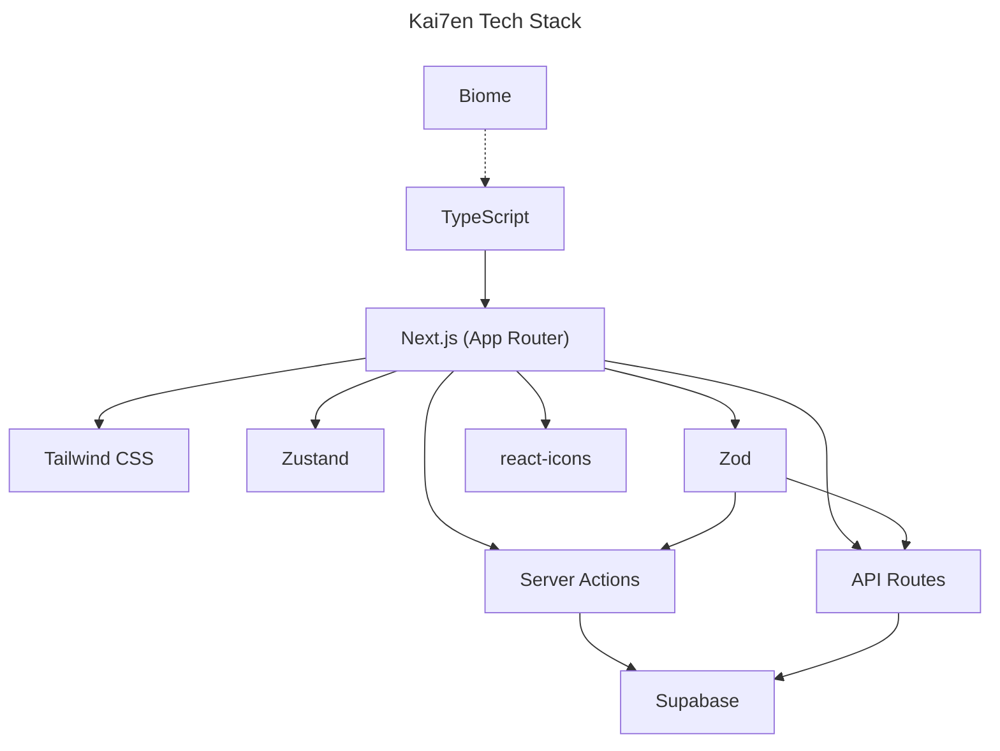
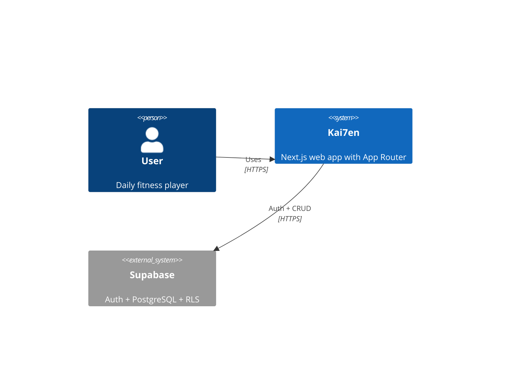
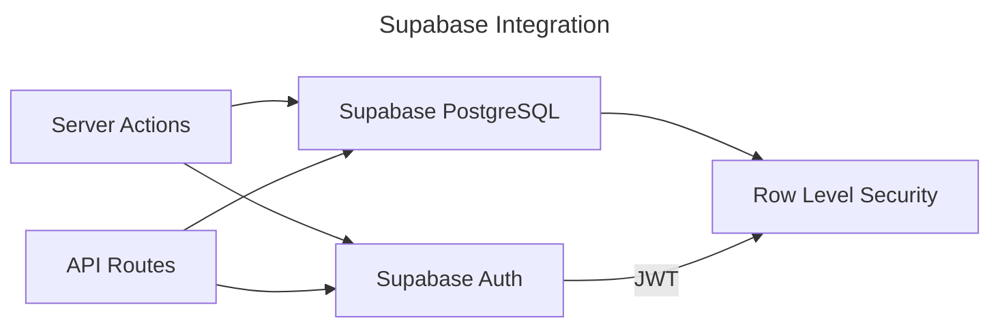

# Architecture

## Language/Framework

### Naming Conventions

- Files: kebab-case for routes, PascalCase for components
- Components: PascalCase
- Functions: camelCase
- Variables: camelCase
- Constants: UPPER_CASE
- Types/Interfaces: PascalCase

## Services Communication

### Supabase

