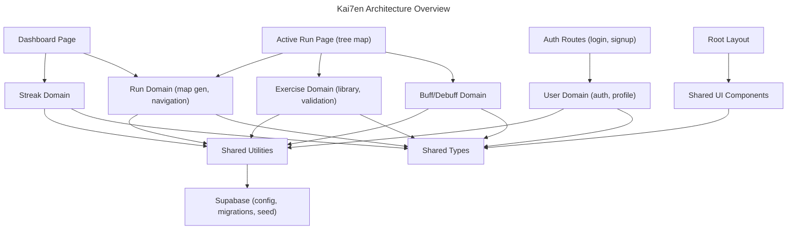

# Codebase Structure

```mermaid
---
title: Kai7en Architecture Overview
---
flowchart TD
    AuthPages["Auth Routes (login, signup)"]
    DashboardPage["Dashboard Page"]
    RunPage["Active Run Page (tree map)"]
    RootLayout["Root Layout"]

    RunDomain["Run Domain (map gen, navigation)"]
    ExerciseDomain["Exercise Domain (library, validation)"]
    BuffDomain["Buff/Debuff Domain"]
    StreakDomain["Streak Domain"]
    UserDomain["User Domain (auth, profile)"]

    SharedComponents["Shared UI Components"]
    SharedLib["Shared Utilities"]
    SharedTypes["Shared Types"]

    SupabaseLayer["Supabase (config, migrations, seed)"]

    AuthPages --> UserDomain
    DashboardPage --> StreakDomain
    DashboardPage --> RunDomain
    RunPage --> RunDomain
    RunPage --> ExerciseDomain
    RunPage --> BuffDomain
    RootLayout --> SharedComponents

    RunDomain --> SharedLib
    ExerciseDomain --> SharedLib
    BuffDomain --> SharedLib
    StreakDomain --> SharedLib
    UserDomain --> SharedLib

    RunDomain --> SharedTypes
    ExerciseDomain --> SharedTypes
    BuffDomain --> SharedTypes
    StreakDomain --> SharedTypes
    UserDomain --> SharedTypes

    SharedLib --> SupabaseLayer
    SharedComponents --> SharedTypes
```
