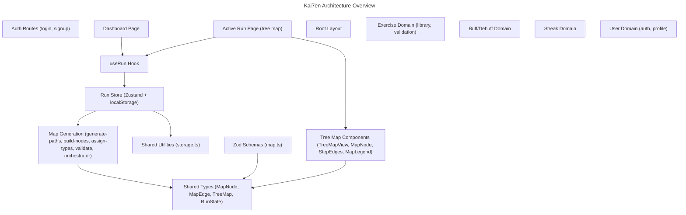

# Codebase Structure

```mermaid
---
title: Kai7en Architecture Overview
---
flowchart TD
    AuthPages["Auth Routes (login, signup)"]
    DashboardPage["Dashboard Page"]
    RunPage["Active Run Page (tree map)"]
    RootLayout["Root Layout"]

    MapGen["Map Generation (generate-paths, build-nodes, assign-types, validate, orchestrator)"]
    RunStore["Run Store (Zustand + localStorage)"]
    UseRun["useRun Hook"]
    TreeMapUI["Tree Map Components (TreeMapView, MapNode, StepEdges, MapLegend)"]
    MapSchemas["Zod Schemas (map.ts)"]

    ExerciseDomain["Exercise Domain (library, validation)"]
    BuffDomain["Buff/Debuff Domain"]
    StreakDomain["Streak Domain"]
    UserDomain["User Domain (auth, profile)"]

    SharedLib["Shared Utilities (storage.ts)"]
    SharedTypes["Shared Types (MapNode, MapEdge, TreeMap, RunState)"]

    DashboardPage --> UseRun
    RunPage --> UseRun
    RunPage --> TreeMapUI

    UseRun --> RunStore
    RunStore --> MapGen
    RunStore --> SharedLib
    MapGen --> SharedTypes
    MapSchemas --> SharedTypes
    TreeMapUI --> SharedTypes
```
