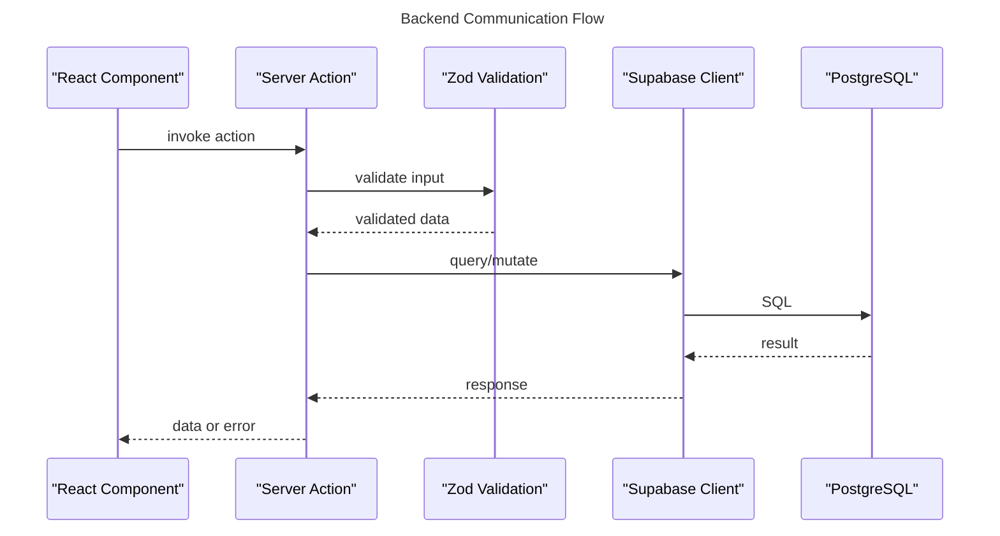

# Backend Communication

## API Definition

- No OpenAPI, Next.js Server Actions

## Services

- Supabase client (auth + database)

## Request Types

- Server Actions (form mutations)
- Supabase client queries (reads)

## Entities

- Located in `src/domains/*/types.ts`

## Data Flow

- Component -> Server Action -> Supabase -> Response

## Error Handling

- Server Actions return `{ error: string } | { data: T }`

## Validation

- Zod schemas at Server Action boundary

## Sequence

