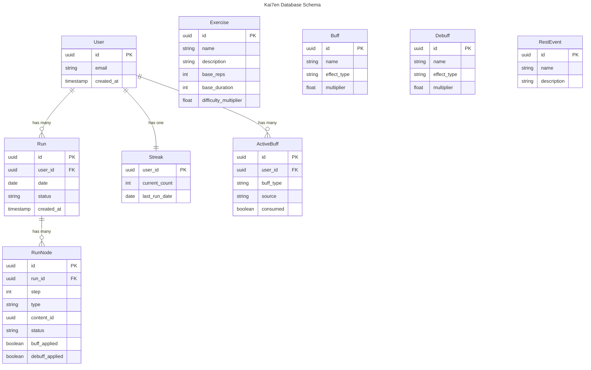

# Database

- Provider: Supabase (PostgreSQL hosted)
- Migrations: Supabase CLI (`supabase migration`)
- Seeding: Supabase seed SQL files

## ER Diagram

## Run Status Values

- active, completed, failed

## RunNode Type Values

- event, challenge, repos

## Buff Effect Types

- reduce_difficulty, skip, swap_node

## Debuff Effect Types

- increase_reps, increase_duration, remove_rest, add_event

## ActiveBuff Source Values

- event, consolation
