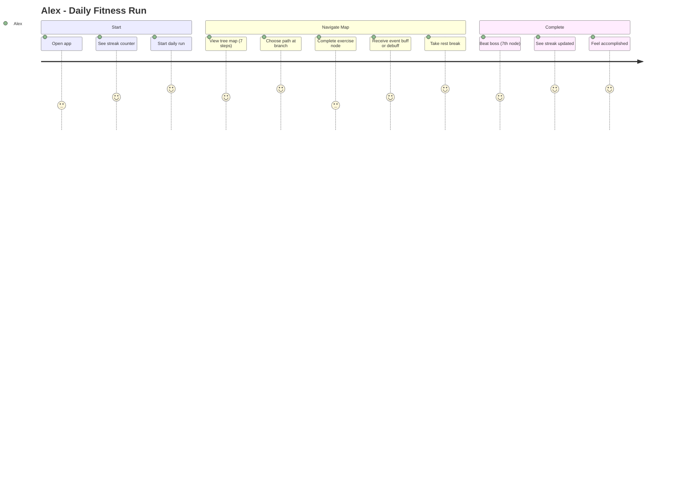
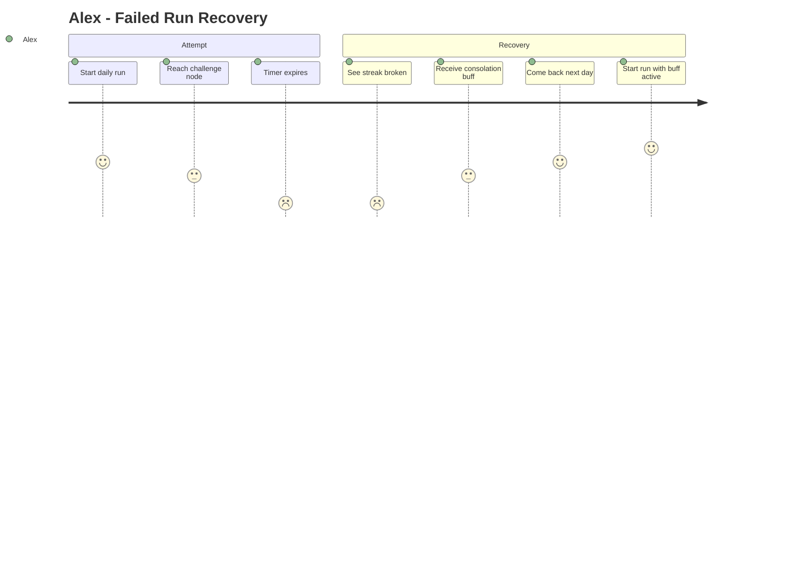

# PROJECT_BRIEF.md

## Executive Summary

- **Project Name**: Kai7en
- **Vision**: Make daily exercise a fun habit through roguelike game mechanics
- **Mission**: Gamify bodyweight fitness with consistency-first philosophy — discipline over intensity

### Full Description

Web app where users complete a daily "run" of 7 steps on a randomly generated tree map. Each step is a bodyweight exercise, random event, or rest break. Progression rewards showing up every day (streaks), not athletic performance. Inspired by Slay the Spire.

## Context

### Core Domain

Gamified fitness habit-building through roguelike mechanics

### Ubiquitous Language

| Term             | Definition                                              | Synonymes   |
| ---------------- | ------------------------------------------------------- | ----------- |
| Run              | Daily session of 7 steps on the tree map                | Session     |
| Node             | A single step on the map                                | Step, Noeud |
| Tree Map         | Randomly generated map with linear paths and branches   | Map, Carte  |
| Challenge        | Exercise node, 5min max, boss is always a Challenge     | -           |
| Event            | Random node resolving to exercise, buff, or debuff      | -           |
| Repos            | Rest activity node (water, walk, meditate, breathe)     | Rest        |
| Streak           | Consecutive days with completed run                     | -           |
| Buff             | Positive modifier (reduce difficulty, skip, swap)       | -           |
| Debuff           | Negative modifier (increase reps/duration, remove rest) | -           |
| Boss             | Final challenge at 7th node                             | -           |
| Consolation Buff | Buff granted after a failed run or broken streak        | -           |

## Features & Use-cases

- **F1 Tree Map & Run**: 7-step tree map with linear/branching paths, 7th step = boss, 1 run/day, node types visible before choice
- **F2 Exercise System**: ~10 bodyweight exercises, no equipment, honor-based validation ("Done" button), 2h timer per node, no repeat in same run
- **F3 Buffs & Debuffs**: ~10 modifiers obtained from Event nodes, consolation buff after failure
- **F4 Streaks**: Complete 7 nodes = streak maintained, failure or no run = streak broken + consolation buff
- **F5 Auth**: Email+password authentication, data persistence (runs, streaks, progression)

## User Journey maps

### Alex (Sedentary office worker)

### Alex (Failed Run)

