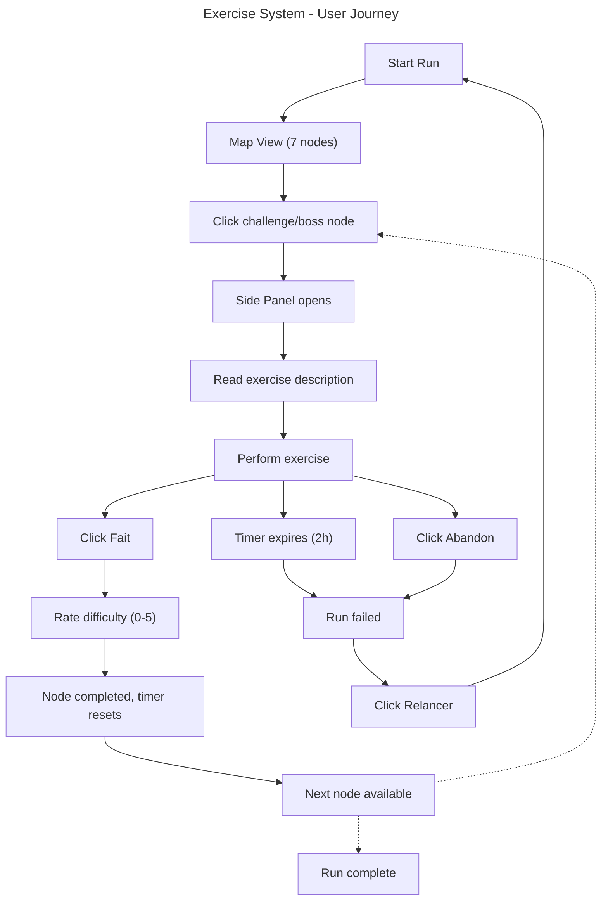

# Instruction: Exercise System (F2)

## Feature

- **Summary**: Add a library of 10 bodyweight exercises, assign them randomly to challenge/boss nodes during a run, display exercise details in a side panel with timer and validation, adjust difficulty based on user feedback score (0-5), persist difficulty across runs
- **Stack**: `Next.js 15.5, React 19, TypeScript 5, Zustand 5, Tailwind CSS 4, Vitest 4`
- **Branch name**: `feat/exercise-system`
- **Parent Plan**: `none`
- **Sequence**: `standalone`
- Confidence: 9/10
- Time to implement: ~4h

## Existing files

- @src/types/index.ts
- @src/store/run-store.ts
- @src/hooks/use-run.ts
- @src/lib/storage.ts
- @src/lib/map-gen/generate-map.ts
- @src/lib/map-gen/assign-types.ts

### New file to create

- src/lib/exercises/library.ts
- src/lib/exercises/select-exercises.ts
- src/lib/exercises/difficulty.ts
- src/hooks/use-exercise-timer.ts
- src/components/exercise/ExercisePanel.tsx
- src/components/exercise/ExerciseTimer.tsx
- src/components/exercise/FeedbackScore.tsx

## User Journey

## Implementation phases

### Phase 1: Exercise Domain

> Define exercise data model, library of 10 exercises, random selection, and difficulty logic

1. Add `Exercise` type to `src/types/index.ts` (id, name, description, baseReps, baseDuration, difficultyMultiplier)
2. Create `src/lib/exercises/library.ts` with 10 bodyweight exercises (pushups, squats, plank, burpees, lunges, mountain climbers, jumping jacks, sit-ups, high knees, wall sit)
3. Create `src/lib/exercises/select-exercises.ts` — pick N random unique exercises for a run
4. Create `src/lib/exercises/difficulty.ts` — compute adjusted reps/duration from base values + stored difficulty multiplier, update multiplier based on feedback score
5. Unit tests for selection (no duplicates) and difficulty adjustment

### Phase 2: Timer Hook

> Countdown hook for 2h per exercise with expiry detection

1. Create `src/hooks/use-exercise-timer.ts` — `useExerciseTimer()` hook
2. Accepts `maxDuration` (default 7200s), returns `{ elapsed, remaining, isExpired, start, reset }`
3. Timer starts on `start()`, resets on `reset()`
4. Calls `onExpire` callback when time runs out
5. Unit test for timer behavior

### Phase 3: Run Store Extension

> Extend Zustand store to handle exercises, feedback scores, and difficulty persistence

1. Add `exerciseMap` to `RunState` (maps node id → Exercise with adjusted params)
2. Add `feedbackScores` to `RunState` (maps node id → score 0-5)
3. New storage key `kai7en-difficulty` for persisted difficulty multiplier
4. Extend `startRun()` to select random exercises and assign to challenge/boss nodes
5. Add `completeExercise(nodeId, score)` action — marks node complete, records score, adjusts difficulty
6. Add `abandonRun()` action — marks run failed, clears state
7. Extend `useRun` hook to expose exercise-related state and actions

### Phase 4: Side Panel UI

> Drawer component showing exercise details, timer, and action buttons

1. Create `ExerciseTimer.tsx` — displays countdown timer (mm:ss format, warning state near expiry)
2. Create `FeedbackScore.tsx` — score selector (0-5 buttons)
3. Create `ExercisePanel.tsx` — side drawer with exercise name, description, adjusted reps/duration, timer, "Fait" button, "Abandon" button
4. "Fait" opens feedback score input, then completes node
5. "Abandon" confirms then fails run
6. Style with Sumi-e design system (parchment bg, sage accents, stone text)

### Phase 5: Integration

> Wire side panel to run store and map view

1. Open panel on challenge/boss node click (via `selectNode`)
2. Close panel on node completion
3. Timer starts when panel opens, resets on completion
4. Timer expiry triggers `failRun()`
5. After fail/abandon, show "Relancer" button that calls `clearRun()` + `startRun()`
6. Ensure non-exercise nodes (event, rest) bypass exercise panel

## Validation flow

1. Start a new run from dashboard
2. Click a challenge node — side panel opens with exercise name, description, reps/duration
3. Verify timer is counting down from 2:00:00
4. Click "Fait" — score selector appears (0-5)
5. Select score 5 (hard) — node completes, next nodes become available
6. Start next exercise — verify reps/duration are reduced (difficulty adjusted down)
7. Click "Abandon" on an exercise — run fails, "Relancer" button appears
8. Click "Relancer" — new run generates with different exercises
9. Verify no exercise repeats within same run
10. Close browser, reopen — verify difficulty multiplier persists across runs
