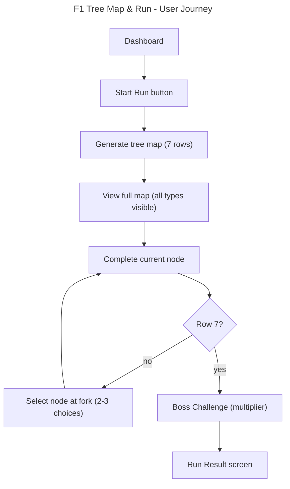

# Instruction: F1 Tree Map & Run

## Feature

- **Summary**: Generate and display a 7-row tree map with branching paths, node type assignment, and sequential navigation. User starts from dashboard, traverses exactly 7 nodes per run, 1 run per day, persisted in localStorage.
- **Stack**: `Next.js 15.5, React 19.1, TypeScript, Zustand v5, Zod v4, Tailwind CSS v4, react-icons v5`
- **Branch name**: `feat/tree-map-and-run`
- **Parent Plan**: `none`
- **Sequence**: `standalone`
- Confidence: 9/10
- Time to implement: medium

## Existing files

- @src/types/index.ts
- @src/lib/storage.ts
- @src/app/globals.css
- @src/app/dashboard/page.tsx
- @src/app/run/page.tsx
- @src/app/run/result/page.tsx
- @src/app/layout.tsx

### New file to create

- src/lib/map-gen/generate-paths.ts
- src/lib/map-gen/build-nodes.ts
- src/lib/map-gen/assign-types.ts
- src/lib/map-gen/validate-map.ts
- src/lib/map-gen/generate-map.ts
- src/lib/map-gen/types.ts
- src/lib/schemas/map.ts
- src/store/run-store.ts
- src/hooks/use-run.ts
- src/components/tree-map/tree-map.tsx
- src/components/tree-map/step-edges.tsx
- src/components/tree-map/map-legend.tsx
- src/components/node/map-node.tsx

## User Journey

## Implementation phases

### Phase 1 - Domain types and schemas

> Define all types and Zod schemas for map, nodes, edges, and run state

1. Extend `src/types/index.ts` with `MapNode`, `MapEdge`, `TreeMap`, `RunState` interfaces
2. Add `"boss"` to `NodeType` union
3. Create Zod schemas in `src/lib/schemas/map.ts` for runtime validation of generated maps
4. Types must cover: node position (row, col), node connections (edges with source/target positions), run progression

### Phase 2 - Map generation algorithm

> Pure functions that generate the tree map structure

1. `generate-paths.ts` - Generate P paths (1: 20%, 2: 50%, 3: 30%) from row 0 to row 6, each path is a sequence of column positions. Row 0-1 always col 0. Row 6 always col 0. Rows 2-5 drift +/-1 (max col 2). Enforce no-crossing constraint by sorting paths.
2. `build-nodes.ts` - Deduplicate paths into unique nodes by (row, col) position. Build edges from path adjacency. Edge start/end positions must match their connected node positions exactly.
3. `assign-types.ts` - Row 0-1 = challenge, row 6 = boss. Rows 2-5 random with constraints: no consecutive rest on same path, fork children have different types, distribution per traversable path (3-4 challenges incl. boss, 1-2 events, 1-2 rest). Constraint propagation with backtrack.
4. `validate-map.ts` - Validate all traversable paths respect distribution and constraints. Pure predicate functions.
5. `generate-map.ts` - Orchestrator: calls generate-paths -> build-nodes -> assign-types -> validate-map. Returns a complete `TreeMap` object.

### Phase 3 - Run state management

> Zustand store with localStorage persistence for run lifecycle

1. Create `src/store/run-store.ts` - Zustand store with: `currentRun` (map + progression), `startRun()`, `selectNode()`, `completeNode()`, `failRun()`, `completeRun()`
2. Persist to localStorage via `storage.ts` wrapper on every state change
3. On init, hydrate from localStorage (resume interrupted run)
4. Create `src/hooks/use-run.ts` - Hook exposing store actions and derived state (current row, available nodes, run status)

### Phase 4 - UI components

> TreeMap, MapNode, StepEdges, MapLegend following Sumi-e design system

1. `map-node.tsx` - Button component rendering node type icon (react-icons) + visual state (active/available/pending/completed/reduced opacity). States driven by props. Challenge: rotated 45deg square for boss.
2. `step-edges.tsx` - SVG component drawing edges between two consecutive rows. Dashed outline-variant for unchosen, solid primary 2.5px for chosen. Coordinates aligned to node flex grid positions (1=50%, 2=33/67%, 3=25/50/75%).
3. `tree-map.tsx` - Vertical layout of 7 rows, each row renders its nodes via MapNode, edges via StepEdges between rows. Scrollable on mobile.
4. `map-legend.tsx` - Card with 2x2 grid showing node type icons and labels.

### Phase 5 - Page integration and navigation

> Wire store + components into pages, handle run lifecycle

1. Dashboard page: show "Start Run" button. If active run exists in localStorage, show "Resume Run" instead. No login required.
2. Run page: generate map on start (or load from store), render TreeMap, handle node selection (tap-to-select at forks) and completion (tap-to-complete on active node). Progressive disclosure: only current row interactive.
3. Run result page: show completion/failure state after run ends.
4. Navigation: dashboard -> /run (on start) -> /run/result (on complete/fail) -> dashboard.

## Validation flow

1. Open app, land on dashboard without login
2. Click "Start Run", tree map appears with 7 rows fully visible
3. Verify row 1 and 2 are Challenge nodes, row 7 is Boss
4. Complete first two nodes (tap-to-complete)
5. At a fork (row 3+), verify 2-3 choices shown with different types
6. Select a path, verify non-selected nodes get reduced opacity
7. Continue navigating, verify no consecutive rest nodes on chosen path
8. Reach and complete boss node (row 7)
9. Verify run result screen appears
10. Return to dashboard, verify "Start Run" is available (not "Resume")
11. Reload page mid-run, verify run state is preserved from localStorage
